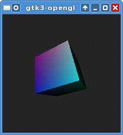

# gtk3-opengl

A small test program to figure out how best to combine GTK+ 3's `GtkGLArea`,
GDK 3's `GdkFrameClock`, and modern OpenGL. Will open a small window with a
rotating, shaded cube that you can interact with with the mouse.

## License

This repository is licensed under the GPL version 3.
